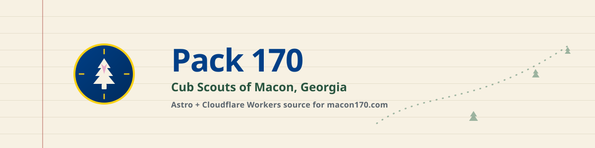

<p align="center">
  <picture>
    <source media="(prefers-color-scheme: dark)" srcset="assets/header-dark.svg">
    <source media="(prefers-color-scheme: light)" srcset="assets/header.svg">
    
  </picture>
</p>

<p align="center">
  <a href="https://github.com/kerryhatcher/macon170.com/actions/workflows/deploy.yml"></a>
  
  
  
</p>
<p align="center">
  
  <a href="LICENSE"></a>
</p>

**Pack 170** is the source for [macon170.com](https://www.macon170.com) — the
official website of Cub Scout Pack 170 in Macon, Georgia, built with
[Astro](https://astro.build) and a
[Cloudflare Workers](https://workers.cloudflare.com) backend.

<p align="center">
  
</p>

## ✨ Features

- 🏕️ **Family-first static site** — [Astro](https://astro.build) pages for
  the calendar, adventures, joining, and volunteering, built to answer
  "is this pack for us?" in under two minutes on a phone
- ✉️ **Turnstile-verified contact form** — parent inquiries are checked
  server-side with [Cloudflare Turnstile](https://developers.cloudflare.com/turnstile/)
  and land in a private, D1-backed volunteer desk, never a public inbox
- 📅 **Draft → publish → archive calendar** — volunteers manage events
  with a full audit trail; the public API only ever exposes published
  family logistics
- 🔐 **Zero-trust admin desk** — every request to `admin.macon170.com` is
  verified against a [Cloudflare Access](https://developers.cloudflare.com/cloudflare-one/policies/access/)
  JWT server-side, not just trusted at the edge
- 🧪 **Real Workers-runtime tests** — [Vitest](https://vitest.dev) unit and
  integration coverage (against actual D1 migrations) plus
  [Playwright](https://playwright.dev) e2e coverage of the full
  contact-to-admin flow
- 🧹 **One-command CI parity** — `just ci` runs the exact lint/check/format/
  test/e2e battery GitHub Actions runs before every deploy

## 🚀 Quick Start

```bash
bun install --frozen-lockfile
cp .dev.vars.example .dev.vars
bun run db:migrate:local
bun run dev:worker
```

Open **http://localhost:8787** — this runs the full Worker (contact API,
admin desk, D1) in front of the built site. For frontend-only iteration
without the API, `bun run dev` starts just the Astro dev server.

## Table of Contents

- [Features](#-features)
- [Quick Start](#-quick-start)
- [Why This Exists](#-why-this-exists)
- [Installation](#-installation)
- [Usage](#-usage)
- [API Reference](#-api-reference)
- [Architecture](#️-architecture)
- [Contributing](#-contributing)
- [Support](#-support)
- [License](#license)
- [Acknowledgements](#-acknowledgements)

## 🤔 Why This Exists

Pack 170 previously ran its web presence on a Square site. This project
replaces it as the pack's primary web presence, serving two audiences
equally: **prospective families** who need to answer "what is this, does
my kid qualify, when/where do you meet, how do I join" in under two
minutes, and **current pack families** looking up the calendar, event
details, and volunteer contacts.

Two constraints shaped the architecture more than anything else:

- **Youth protection.** Youth are identified by first name and last
  initial only, no photos without consent, and every contact channel is
  parent-framed and reaches multiple adults — there's no one-to-one
  adult–youth messaging path.
- **Scouting America brand rules.** Official marks are used unmodified
  only, sourced from the Brand Center, with no ads, no merchandise
  sales, and a required non-endorsement disclaimer — this site is run
  by pack volunteers, not Scouting America or the Central Georgia
  Council.

Those constraints are why the admin desk is Access-gated rather than a
public CMS, and why the data model tracks an audit trail for every
submission and event change.

## 📦 Installation

**Prerequisites:** [Bun](https://bun.sh) and a
[Cloudflare account](https://dash.cloudflare.com) with
[Wrangler](https://developers.cloudflare.com/workers/wrangler/)
authenticated (`bunx wrangler login`).

```bash
git clone https://github.com/kerryhatcher/macon170.com.git
cd macon170.com
bun install --frozen-lockfile
cp .dev.vars.example .dev.vars
bun run db:migrate:local
```

`.dev.vars` holds `TURNSTILE_SECRET`, set by default to Cloudflare's
documented always-pass test secret — safe for local development, never
used in production.

<details>
<summary><strong>Environment variables reference</strong></summary>

| Variable                              | Where                               | Purpose                                                                                                         |
| ------------------------------------- | ----------------------------------- | --------------------------------------------------------------------------------------------------------------- |
| `TURNSTILE_SECRET`                    | `.dev.vars` (Worker secret in prod) | Server-side [Turnstile](https://developers.cloudflare.com/turnstile/) verification                              |
| `TURNSTILE_SITE_KEY`                  | `wrangler.jsonc` vars               | Client-side Turnstile widget key                                                                                |
| `ACCESS_TEAM_DOMAIN`                  | `wrangler.jsonc` vars               | Your `https://TEAM.cloudflareaccess.com` domain                                                                 |
| `ACCESS_AUD`                          | `wrangler.jsonc` vars               | [Cloudflare Access](https://developers.cloudflare.com/cloudflare-one/policies/access/) application audience tag |
| `ADMIN_ORIGIN` / `PUBLIC_SITE_ORIGIN` | `wrangler.jsonc` vars               | Expected origins for CORS and redirects                                                                         |

Full production setup, including Access policy configuration and GitHub
Actions secrets, is documented in
[`docs/CLOUDFLARE-DEPLOYMENT.md`](docs/CLOUDFLARE-DEPLOYMENT.md).

</details>

## 🔧 Usage

| Command                   | What it does                                                     |
| ------------------------- | ---------------------------------------------------------------- |
| `bun run dev`             | Astro dev server only (no API, no D1)                            |
| `bun run dev:worker`      | Full Worker + static site + local D1, at `:8787`                 |
| `bun run build`           | Type-checks and builds to `dist/`                                |
| `bun run test`            | [Vitest](https://vitest.dev) unit + integration                  |
| `bun run test:e2e`        | [Playwright](https://playwright.dev) e2e coverage                |
| `bun run lint` / `format` | [ESLint](https://eslint.org) and [Prettier](https://prettier.io) |
| `just ci`                 | The full local battery, same as CI                               |

Run `just ci` before every commit — it's the same battery
[GitHub Actions](https://docs.github.com/actions) runs before it will
deploy.

## 📖 API Reference

One Worker serves both the static Astro output and the API:

- **`POST /api/contact`** — Turnstile-verified, rate-limited parent
  inquiries, written to [D1](https://developers.cloudflare.com/d1/)
- **`GET /api/events`** — public, read-only, published-only calendar data
- **`GET /api/calendar.ics`** — public iCalendar subscription containing
  published events; stable event IDs and revision metadata let calendar apps
  apply volunteer updates without creating duplicate entries
- **`admin.macon170.com/*`** — the volunteer desk; every request
  requires a Cloudflare Access JWT verified server-side against
  Cloudflare's rotating JWKS, and every view or status change is
  written to an audit log tied to the verified email

See [`docs/CLOUDFLARE-DEPLOYMENT.md`](docs/CLOUDFLARE-DEPLOYMENT.md) for
the data-safety and deployment model. The complete machine-readable API
contract is in [`docs/openapi.yaml`](docs/openapi.yaml).

## 🏗️ Architecture

```
src/               Astro pages, layouts, and components (the public site)
src/data/pack.ts   The single editable file for pack-specific facts
worker/            Cloudflare Worker: contact API, admin desk, calendar CRUD
migrations/        D1 schema (contact_submissions, calendar_events, audit)
e2e/               Playwright coverage of the contact-to-admin flow
docs/              Deployment runbook and pack research/reference material
```

## 🤝 Contributing

This is a small, volunteer-maintained pack site, but pull requests, bug
reports, and content corrections are welcome. See
[CONTRIBUTING.md](CONTRIBUTING.md) for local setup, the PR process, and
code standards. Please also read our
[Code of Conduct](CODE_OF_CONDUCT.md).

## 💬 Support

- **Bugs or feature ideas:** open a
  [GitHub issue](https://github.com/kerryhatcher/macon170.com/issues)
- **Security or data-safety concerns:** see [SECURITY.md](SECURITY.md) —
  please don't file these as public issues
- **Pack questions** (meeting times, joining, events): use the
  [contact page](https://www.macon170.com/contact) on the live site,
  not this repository

## License

MIT — see [LICENSE](LICENSE).

## 🙏 Acknowledgements

- Cub Scout Pack 170 is chartered by
  [Highland Hills Baptist Church](https://highlandhillsbaptist.org) in
  Macon's Shirley Hills neighborhood, part of the
  [Central Georgia Council](https://www.centralgeorgiacouncil.org),
  Scouting America.
- This is a volunteer-run site, not an official Scouting America or
  council communication channel. Scouting trademarks and design marks
  belong to Scouting America; no endorsement of this site or its
  non-Scouting activities is implied.
- Built with [Astro](https://astro.build) and
  [Cloudflare Workers](https://workers.cloudflare.com).
